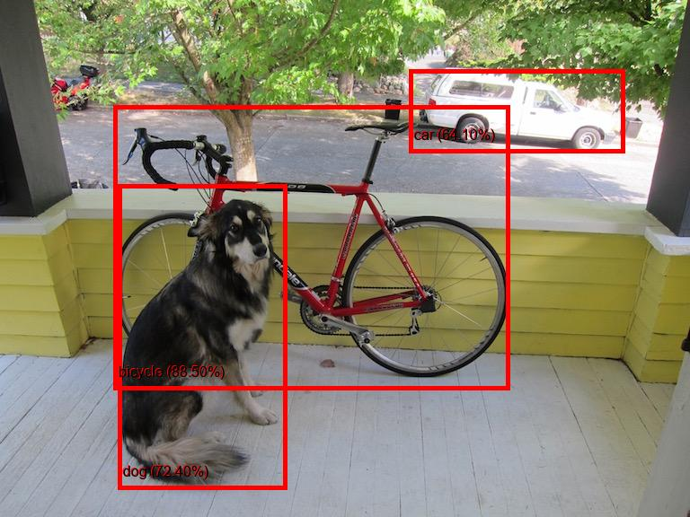

# Object Detection and Analysis with Azure Cognitive Services

This Python application utilizes Azure Cognitive Services to perform object detection, sentiment analysis, and Azure Blob Storage integration on a set of images. The goal is to showcase how multiple Azure services can be combined to enhance image processing and analysis tasks.

## Prerequisites

Before running the application, ensure you have the following:

1. Azure Cognitive Services subscription keys and endpoints for Computer Vision and Text Analytics.
2. An Azure Blob Storage account with the connection string and container name.
3. Python 3.x installed.
4. Required Python packages: azure-cognitiveservices-vision-computervision, msrest, azure-storage-blob, azure-ai-textanalytics, PIL, matplotlib, numpy.


## Setup

1. Clone this repository to your local machine.
2. Install the required Python packages:

```bash
pip install azure-cognitiveservices-vision-computervision msrest azure-storage-blob azure-ai-textanalytics pillow matplotlib numpy
```  

3. Replace the placeholders in the code with your actual subscription keys, endpoints, connection string, and container name.

## Usage

1. Place your images in the cv_demo_images directory.
2. Run the Python script:

```bash
python image_analysis.py

```
3. The script will perform the following tasks on each image:

- Detect objects using Computer Vision API.

-  Perform sentiment analysis using Text Analytics API.

-  Upload the analyzed image to Azure Blob Storage.

4. The analysis results, including sentiment scores and Blob Storage URLs, will be printed to the console.

## Output

The script will save the processed images with object detection bounding boxes in the cv_demo_images_output directory. Additionally, it will display bar charts showing the confidence rate of object detection and performance metrics.

---

# Project Overview

The goal of this project is to showcase the integration of Azure services for image recognition and sentiment analysis. It demonstrates how Azure Cognitive Services, specifically Azure Computer Vision and Azure Text Analytics, can be used to perform object detection in images, analyze the sentiment of detected objects, and store and visualize the results.

---

# Azure Services Used

**1. Azure Computer Vision**: We utilize Azure Computer Vision to detect objects within images. This service allows us to identify and annotate objects present in the images, along with their confidence scores.

**2. Azure Text Analytics**: Azure Text Analytics is employed for sentiment analysis. It evaluates the sentiment (positive, negative, or neutral) of object names detected by Azure Computer Vision, providing valuable insights into the emotional tone associated with these objects.

**3. Azure Blob Storage**: Azure Blob Storage is used to store the modified images with bounding boxes and annotations. This service ensures that the processed images are easily accessible and can be shared or analyzed further.

---

# Installation and Setup

To set up and run this project, follow these steps:

1. **Clone the Repository**: Clone this GitHub repository to your local machine using the following command:
   ```
   git clone https://github.com/pulkit1s/FIinalprojectFRT
   ```

2. **Install Dependencies**: Ensure that you have the required Python libraries installed. You can install them using pip:
   ```
   pip install azure-cognitiveservices-vision-computervision azure-ai-textanalytics msrest matplotlib pillow scikit-learn
   ```

3. **Azure Configuration**: Replace the placeholders in the code with your Azure service keys and endpoints. Make sure you have the necessary Azure resources provisioned, such as Azure Computer Vision, Azure Text Analytics, and Azure Blob Storage.

4. **Run the Code**: Execute the Python script to process images and perform object detection and sentiment analysis:
   ```
   python Python_azure.py
   ```

---

# Screenshots
-1.webp)
 
  
   
    
     
      
       # Screenshots


---

# Code Structure

The project code is organized as follows:

- `Python_azure.py`: This is the main script that performs object detection, sentiment analysis, and other tasks. It includes comments and explanations for each section.
- `README.md`: You're currently reading this README file.
- `cv_images_images`: folder where the input images are stored.
- `cv_images_images`: folder where the output images are stored.

---

# Usage and Features

Users can interact with this project by following the installation and setup instructions provided above. After setup, they can run the script to process images and receive object detection results with confidence scores and sentiment analysis results for detected object names. The project's key features include:

- Object Detection: Detection of objects within images with confidence scores.
- Sentiment Analysis: Analysis of the sentiment (positive, negative, or neutral) associated with detected object names.
- Azure Integration: Integration with Azure Cognitive Services and Azure Blob Storage for seamless image processing and storage.

---

# Acknowledgments

We would like to give credit to the following libraries and services that contributed to the success of this project:

- [Azure Cognitive Services](https://azure.microsoft.com/services/cognitive-services/): For providing powerful tools for image recognition and text analytics.
- [scikit-learn](https://scikit-learn.org/): For assisting with the calculation of performance metrics.
- [Pillow (PIL Fork)](https://pillow.readthedocs.io/en/stable/index.html): For image processing and annotation.
- [Matplotlib](https://matplotlib.org/): For creating visualizations.

---


By [Pulkit Sharma]
sharmapulkit001@gmail.com

Please examine this project based on the GitHub repository and this README file, as my Azure service credits have expired. If you have any questions or need further information, please feel free to reach out.

---
